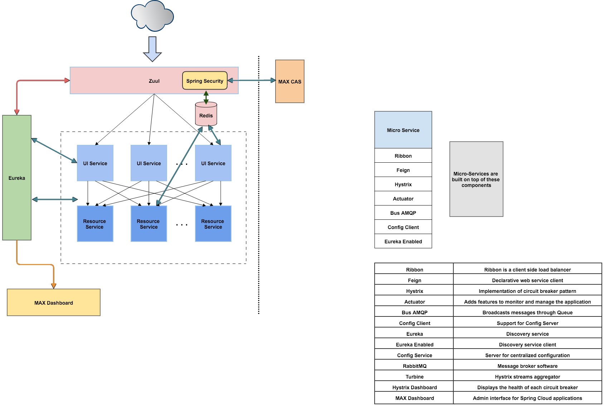

# MAX Application Services Example

A sample project that demonstrates the end-to-end MAX Application Service platform using Spring Cloud for building MAX micro-services. This project creates a VM with the MAX API Gateway and MAX Registry infrastructure services, and two sample microservices. 

The services are deployed into Docker containers inside a Vagrant VM. These services are implemented in Java, using Spring and Spring Cloud, and secured behind the MAX Gatway using a mock CAS server.

Demonstrated concepts:

* Host platform using Docker
* MAX Microservice architecture
* Service discovery
* API gateway
* MAX Security with CAS

The demo system consists of two micro-services:

* MAX Angular SPA, a UI interface showing a list of TODO data items.
* Resource service that handles TODO data.

## Docker

Each service is built and deployed using Vagrant and Docker. Docker compose will be used at a later time as another option.

### Resource

This example application service handles the data for the UI. It runs behind the MAX Gateway and registers itself the the MAX Registry upon startup.

### UI

This example application service is the front-end UI served by the MAX Gateway. It runs behind the MAX Gateway and registers itself the the MAX Registry upon startup.

### Data Services

Coming soon...

### Spring Cloud 

* Eureka is used by the MAX Registry for service lookup and load balancing.
* Zuul is used by the MAX Gateway to route HTTP requests from the outside world to the different services.
* Spring Boot is the container that runs the micro-services.

### AngularJs

* AngularJs is the client-side framework for HTML5 development.

## Microservice architecture

This example project demonstrates how to build a new MAX application using microservices, as opposed to a monolith-first strategy. Each microservice in the project is a Spring Boot application, and with this framework developers have the advantage of being able to run and develop with each microservice running on their local machine. Adding a new microservice is easy, as the discovery microservice will automatically discover new services running on the cluster and it's routes and Swagger API will be auto-discovered by the API Gateway.

### Target Architecture

### Service discovery

This project a discovery service using Netflix Eureka as a proxy-based API gateway.

### API gateway

Each microservice will coordinate with Eureka to retrieve API routes for the entire cluster. Using this strategy each microservice in a cluster can be load balanced and exposed through one API gateway. Each service will automatically discover and route API requests to the service that owns the route. This proxying technique is equally helpful when developing user interfaces, as the full API of the platform is available through its own host as a proxy.

How To Run
----------

The demo is setup with [Vagrant and Docker](docker-vagrant/README.md). 

Remarks on the Code
-------------------

The servers for the infrastructure are pretty simple thanks to Spring Cloud:

* max-registry is the Eureka server for service discovery.
* max-gateway is the Zuul server. It distributes the requests to the two microservices, and the CAS security service.

The micro-services are: 

* ui is the application that displays a list of TODO items.
* resource is application responsible for serving data to the ui.